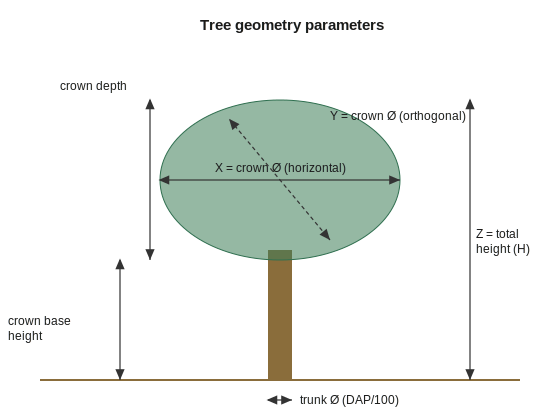

# How it works

## Input
An inventory table with at least: `tree_id`, `common_name`, `scientific_name`,
`perimeter_cm`.

## Steps
1. **DBH** — `DBH = P/π` (cm); trunk diameter `= DBH/100` (m).
2. **Height** — asymptotic model `H = 1.30 + (H∞ − 1.30)·[1 − exp(−DBH/k)]`,
   rounded to 0.5 m.
3. **Height band** — `max(2, 0.8·H)` to `1.2·H` (sensitivity scenario).
4. **Crown (heuristic)** — `D = min(factor·trunk; limit·H)`; palms
   `D = clip(0.35·H, 3.5, 6.0)`.
5. **Crown base, depth and area.**
6. **Confidence and warnings** per tree.

## Output
A result table and a **formula-free DIALux table** (X, Y, Z and other fields).

<figure markdown>
  
  <figcaption>Mapping between the estimated parameters and the 3D geometry.</figcaption>
</figure>
