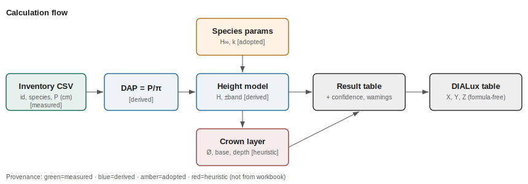
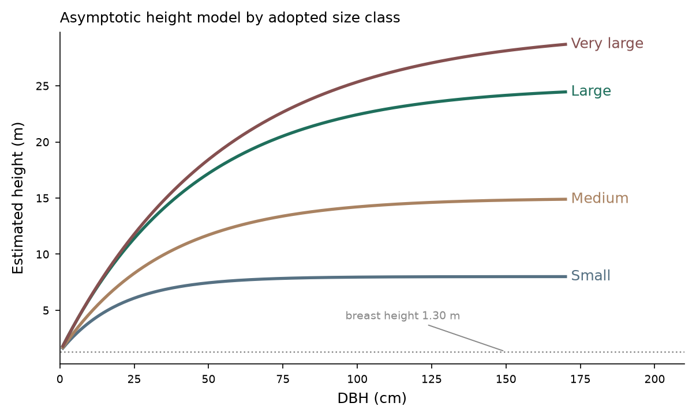

# Tree Geometry Estimator for Outdoor Lighting Models

!!! tip "Interactive calculator"
    Try the **[interactive calculator](app/index.html)** — runs entirely in your browser, no upload.

**Preliminary estimation of tree height, crown diameter and geometry parameters
for outdoor lighting models.**

!!! warning "Methodological disclaimer"
    Results are **preliminary estimates** for lighting pre-modelling. The tool
    **does not replace** field dendrometric survey, forest inventory,
    arboricultural report, stability assessment or topographic survey. Parameters
    are not locally calibrated; the ranges are **sensitivity scenarios**, not
    statistical confidence intervals. Real crowns may be asymmetric; pruning and
    urban conditions change the geometry; palms carry higher uncertainty; trees
    near luminaires should be measured in the field.

[Methodology](methodology-page.md){ .md-button }
[Demonstration](demo.md){ .md-button }
[Repository :simple-github:](https://github.com/czanchetta/urban-tree-geometry){ .md-button .md-button--primary }

## Summary

From a minimal inventory — identifier, species and **trunk perimeter** — the
tool computes DBH, estimated height, crown diameter and the X, Y and Z
parameters for preliminary 3D tree modelling in DIALux.

<figure markdown>
  
  <figcaption>Calculation flow, with the provenance of each value
  (measured, derived, adopted, heuristic).</figcaption>
</figure>

## Example result

<figure markdown>
  
  <figcaption>Asymptotic height model by adopted size class.</figcaption>
</figure>

The height core faithfully reproduces the source workbook (62/62 rows
identical). The crown/DIALux layer is an engineering **heuristic**, clearly
labelled and not validated against the workbook.
