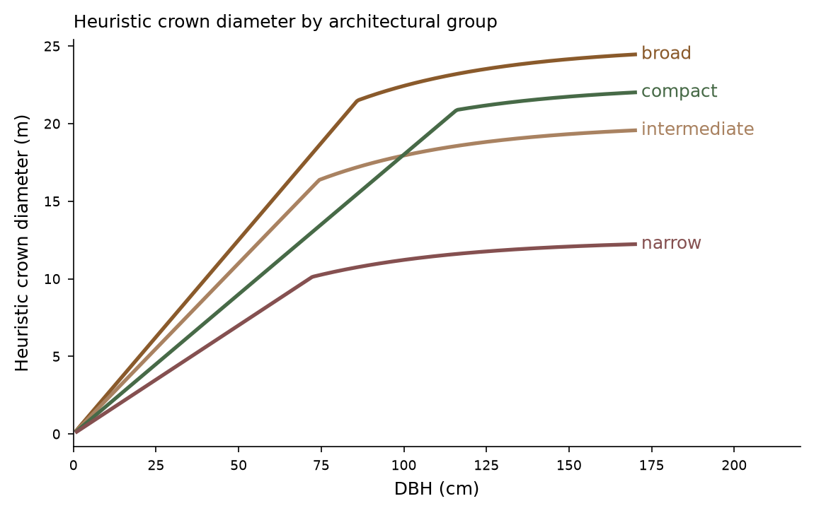
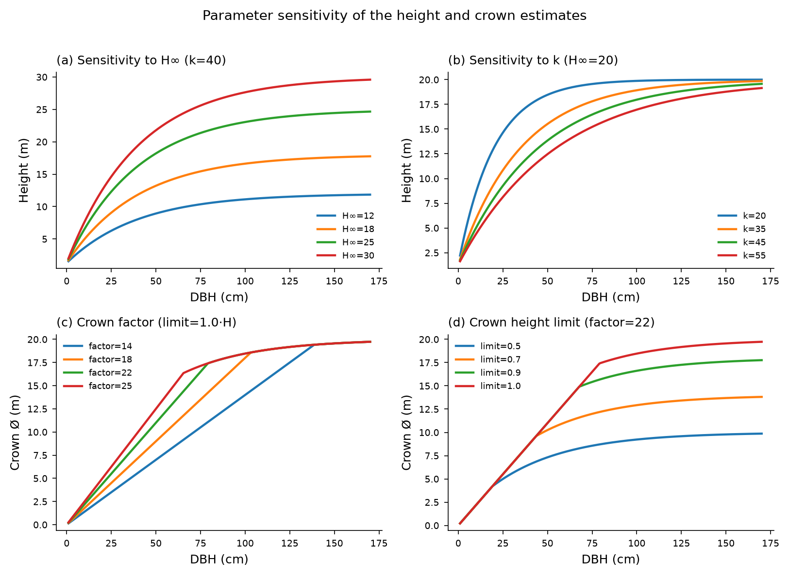

# Metodologia

!!! warning "Ressalva metodológica"
    Os resultados representam **estimativas preliminares** destinadas à
    pré-modelagem luminotécnica. A ferramenta **não substitui** levantamento
    dendrométrico, medição de campo, inventário florestal, laudo arborístico,
    avaliação de estabilidade ou levantamento topográfico. Os parâmetros não
    foram calibrados localmente; os intervalos são **cenários de sensibilidade**,
    não intervalos estatísticos de confiança. Copas reais podem ser assimétricas;
    poda e condições urbanas alteram a geometria; palmeiras têm maior incerteza;
    árvores próximas a luminárias devem ser medidas em campo.

## DAP
`DAP = P/π`, admitindo seção circular medida a ~1,30 m (convenção FAO).

## Altura
`H = 1,30 + (H∞ − 1,30)·[1 − exp(−DAP/k)]`. `H∞` é um porte adulto de referência
**adotado** por espécie (não é máximo normativo); `k` é um parâmetro operacional
**não calibrado** localmente. Resultado arredondado a 0,5 m.

## Dossel (heurístico)
Grupos arquitetônicos com fatores operacionais (amplo 25, intermediário 22,
compacto 18, estreito 14) e limite de altura por grupo. Palmeiras usam regra
própria. Estes valores **não** são coeficientes dendrométricos publicados por
espécie.

<figure markdown>
  
  <figcaption>Diâmetro heurístico do dossel por grupo arquitetônico.</figcaption>
</figure>

## Sensibilidade
<figure markdown>
  
  <figcaption>Efeito de H∞, k, fator de dossel e limite de altura.</figcaption>
</figure>

A metodologia completa está em `docs/methodology.md` no repositório.
